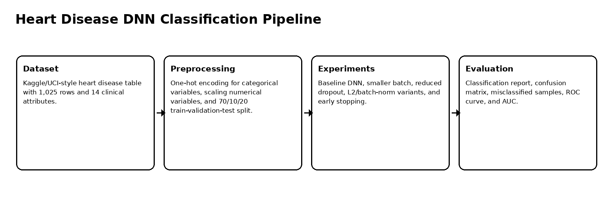
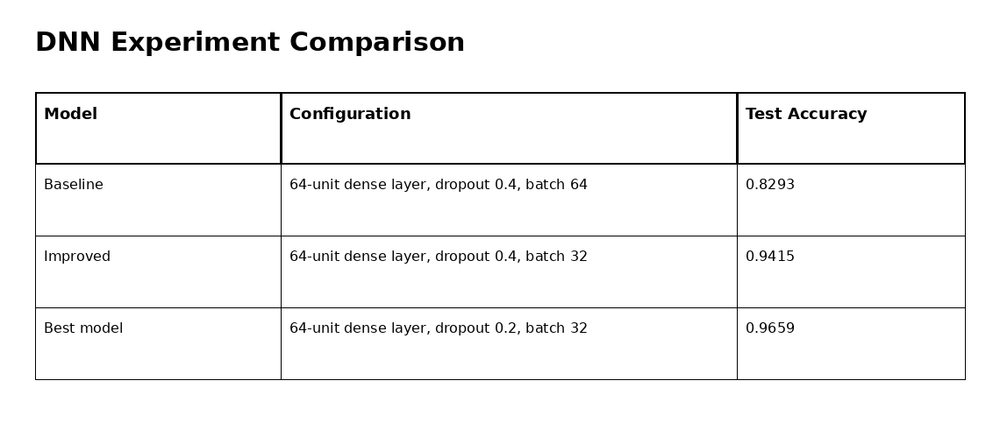
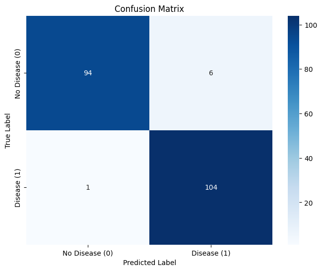
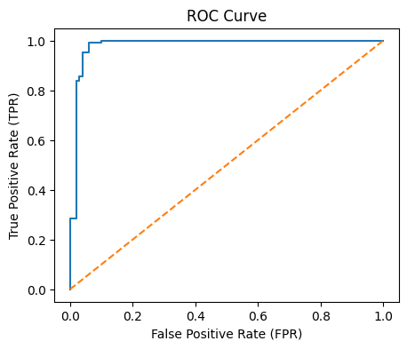
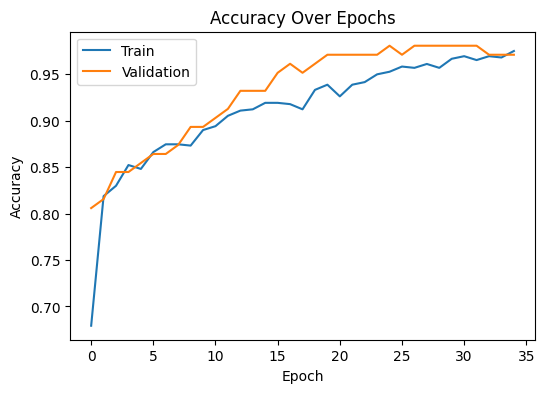
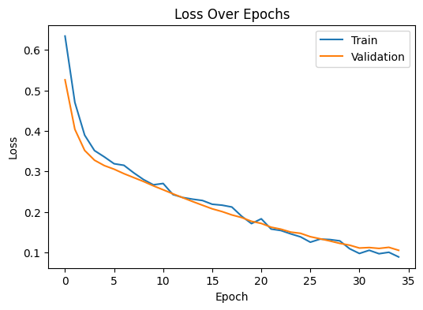

# Heart Disease DNN Classification

Deep neural network workflow for binary heart disease prediction using tabular clinical attributes, preprocessing, hyperparameter experiments, and diagnostic evaluation.

## Overview

This project builds a neural-network classifier for heart disease prediction using a structured clinical dataset. It covers the full machine learning workflow: dataset inspection, preprocessing, feature encoding, model development, hyperparameter experiments, and final diagnostic evaluation.

## Dataset

| Item | Details |
|---|---|
| Dataset | Heart Disease dataset |
| Source | Kaggle Heart Disease dataset based on UCI-style clinical attributes |
| Records | 1,025 |
| Original attributes | 14 |
| Target | `0 = No Disease`, `1 = Disease` |
| Final feature matrix | 27 encoded/scaled features |
| Split | 70% training, 10% validation, 20% testing |

## Modeling Workflow



The notebook uses one-hot encoding for categorical clinical variables and `StandardScaler` for numerical features. The model is trained with early stopping to reduce overfitting and restore the best validation checkpoint.

## Experiments



| Experiment | Main change | Test accuracy |
|---|---|---:|
| Baseline model | Initial DNN setup | 0.8293 |
| Improved model | Smaller batch size | 0.9415 |
| Best model | Reduced dropout to 0.2 | 0.9659 |
| L2 / BatchNorm variants | Additional regularization and architecture tests | 0.8341–0.8732 |

The strongest model used one hidden layer with 64 units, dropout of 0.2, learning rate of 0.001, batch size of 32, and early stopping after 35 epochs.

## Final Evaluation

| Metric | No Disease | Disease |
|---|---:|---:|
| Precision | 0.9895 | 0.9455 |
| Recall | 0.9400 | 0.9905 |
| F1-score | 0.9641 | 0.9674 |
| Support | 100 | 105 |

Overall results:

| Metric | Value |
|---|---:|
| Test accuracy | 0.9659 |
| Weighted F1-score | 0.9658 |
| AUC | 0.9813 |
| Misclassified samples | 7 out of 205 |

## Interpretation

The final model achieved strong and balanced performance across both classes. Recall for the Disease class reached 0.9905, meaning the model was especially strong at identifying positive heart disease cases. The AUC of 0.9813 indicates excellent class separability.

Misclassification analysis was included to inspect the small number of incorrect predictions and understand where the model struggled.

## Visual Summary

| Confusion matrix | ROC curve |
|---|---|
|  |  |

| Accuracy curve | Loss curve |
|---|---|
|  |  |

## Repository Contents

```text
.
├── heart_disease_dnn_classification.ipynb
├── docs/
│   └── figures/
├── requirements.txt
├── .gitignore
└── README.md
```

## Run Locally

This repository is notebook-based. Create a clean Python environment, install the dependencies, then open the notebook.

### Windows PowerShell

```powershell
py -3.10 -m venv .venv
.\.venv\Scripts\Activate.ps1
python -m pip install --upgrade pip
pip install -r requirements.txt
```

### Linux / macOS

```bash
python3 -m venv .venv
source .venv/bin/activate
python -m pip install --upgrade pip
pip install -r requirements.txt
```


## Open the Notebook

```bash
jupyter notebook heart_disease_dnn_classification.ipynb
```

## Notes

This project is for educational machine learning experimentation and is not a clinical decision system.
